# Программа для имитационного моделирования системы массового обслуживания (СМО)
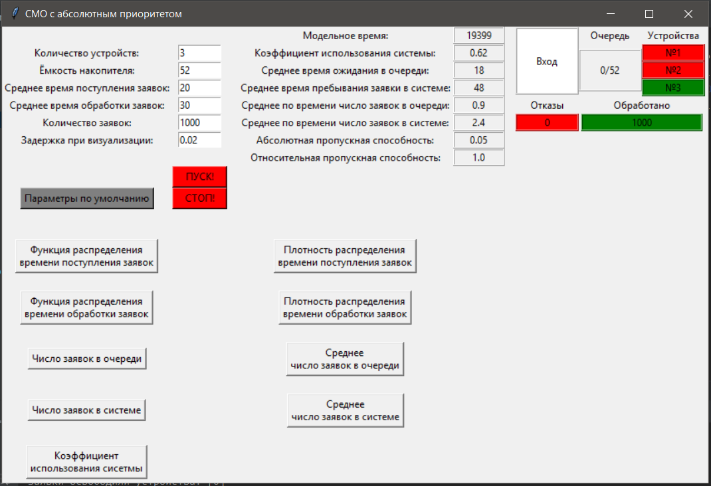

## Решаемая задача
Программа позволяет проводить имитационное моделирование СМО с s устройствами, каждое из которых может одновременно обслуживать только одно требование.
Интервалы времени между поступлением требований являются независимыми случайными величинами со средним значением µA. 
Время обслуживания является случайной величиной, некоррелированной с интервалами поступления требований. 
Среднее значение времени обслуживания требований – µS. 
Если в момент поступления очередного требования имеется хотя бы одно свободное устройство, то оно немедленно приступает к обслуживанию этого требования, а если все обслуживающие устройства заняты и в очереди находится не более l-1 требования, то реакция системы определяется дисциплиной обслуживания. 
Если же в очереди находятся l требований, то очередное требование покидает систему необслуженным.

Реализуемая дисциплина обслуживания - с абсолютным приоритетом на пять значений.

## Генераторы случайных чисел
Для моделирования экспоненциально распределенной случайной величины наиболее часто используется метод обратного преобразования. На первом шаге с помощью мультипликативного генератора создается последовательность стандартно равномерно распределенных случайных чисел Yi:

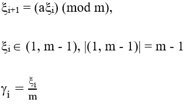

Рекомендуемые параметры, обеспечивающие для такого генератора максимальный период: m = 2^31 - 1 = 2147483647; a = 630360016.

Затем стандартно равномерно распределенная случайная величина Y преобразуется в величину X с заданным законом распределения F согласно формуле: X = F^-1(Y), где F^-1 – это обратная функция распределения F.

Для экспоненциально распределенной случайной величины X = -µ * ln(1 - Y), но, поскольку величины 1-Yи Y имеют одинаковое распределение U(0,1), то для моделирования можно использовать следующую формулу: X = -µ * ln(Y).

Начальные условия для генераторов могут быть взяты любые из множества допустимых значений, т.е. любые целые положительные числа меньше или равны (m–1), где m – модуль мультипликативного генератора.
### Моделирование приоритетов
Таблица распределения приоритетов
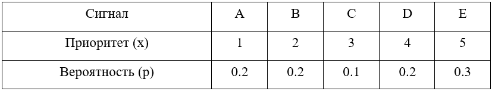

Для получения дискретных случайных чисел также можно воспользоваться методом обратной функции. 
На первом этапе генерируется равномерно распределенная на интервале (0,1) случайная величина Y. 
Тогда алгоритм вычисления дискретных случайных чисел таких, что P(X=x1) = p1, P(X=x2) = p2, …, P(X=xn) = pn, сводится к выполнению следующих действий:
- если Y < p1, то X = x1, иначе 
- если Y < p1 + p2, то X = x2, иначе
- ……………………………………
- если Y < p1 + p2 + … + pn, то X = xn.

Полученная таким образом последовательность будет соответствовать дискретной случайной величине с заданной таблицей распределения.
### Проверка генераторов
#### Оценка математического ожидания и дисперсии
Расчеты на n=1000:
- Для экспоненциального распределения теоретическое мат. ожидание = 1, вычисленное = 0.97; теоретическая дисперсия = 1, вычисленная = 1.15
- Для дискретной случайной величины теоретическое мат. ожидание = 3.2, вычисленное = 3.16; теоретическая дисперсия = 2.36, вычисленная = 2.39
#### Оценка корреляционной функции
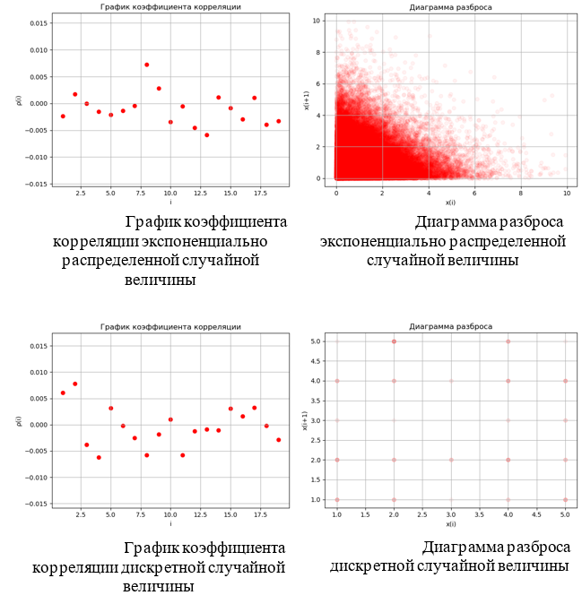
#### Проверка гипотезы о значении математического ожидания
Полученные доверительные интервалы при n = 1000 и a = 0.05, u = 1.96:
- Для экспоненциального распределения µ = 1, доверительный интервал: (0.904, 1.036).
- Для дискретной случайной величины µ = 3.2, доверительный интервал: (3.064, 3.256).

Статистики критерия значимости:
- Для экспоненциального распределения |Z| = |-0.885| < u.
- Для дискретной случайной величины |Z| = |-0.818| < u.
#### Проверка гипотезы о законе распределения методом гистограмм
| 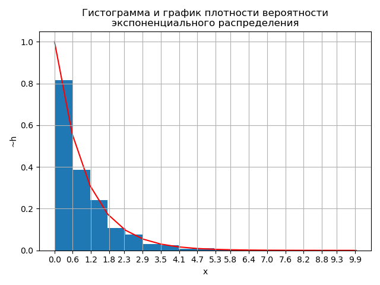 | 
|:--:| 
| *Гистограмма и график плотности вероятности экспоненциального распределения при n=1000 и µ=1* |

| 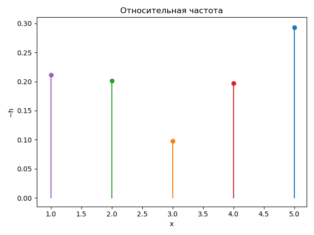 | 
|:--:| 
| *График частоты появления дискретной случайной величины, сгенерированной по заданному в Таблице распределения приоритетов распределению при n=1000* |
#### Проверка гипотезы о законе распределения генеральной совокупности методом X2
Согласно формуле 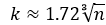 k = 17.
Для уровня значимости a = 0.05 и k-3 = 14 степеней свободы X2 = 23.68. 
Таким образом, |Z| = 14.7 < X2.

## Алгоритмизация и программирование имитационной модели
Программа реализована на языке программирования Python 3.8. Для реализации пользовательского интерфейса была использована библиотека tkinter.

В основе разработки программной реализации СМО использован принцип дискретно-событийного моделирования.

Условие остановки моделирования определяется как достижение заданного в параметрах количества обслуженных требований.

### Структура программы
- bin - здесь находится реализация всех необходимых классов для моделирования СМО и статических вспомогательных фунций-инструментов;
- test - здесь запускаются тестирование генераторов и прогоны системы;
- main.py – файл запуска окна приложения для моделирования работы СМО.

Классы:
- Claim – заявка, содержит следующие поля: время поступления, время начала обслуживания, время обслуживания и приоритет.
- Queueing – движок СМО. Класс содержит поля: устройства (список словарей, содержащих информацию о занятости устройства, обслуживаемой заявке и общем времени занятости устройства), размер накопителя, накопитель (двумерный список с заявками, находящимися в очереди, сгруппированными по приоритетам, отказы (список заявкок, которым было отказано), вытеснения (количество совершенных вытеснений заявок с менишим приоритетом заявками с большим приоритетом) и список с обслуженными заявками. Публичные методы класса: добавить новую заявку; убрать обслуженные заявки с устройств и занять их заявками из очереди; получить коэффициент использования системы; получить количество заявок, поступивших в систему; получить среднее время ожидания заявки в очереди.
- Generator – генератор, содержит реализации мультипликативного генератора и методов получения экспоненциально распределенной  и дискретной случайной величины.
- Ui – класс для работы с пользовательским интерфейсом.
### Алгоритм работы программы
Моделирование запускается в отдельном потоке. 
В переменную sec записывается текущее время в секундах. 
В цикле, пока не выполнится условие останова, каждая очередная итерация выполняется в конкретную секунду времени.

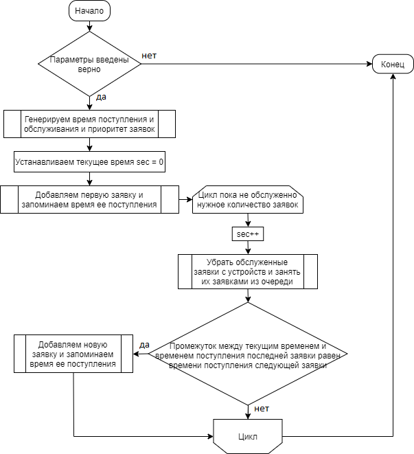

### Возможности пользовательского интерфейса
Интерфейс обеспечивает пользователю возможность управления процессом моделирования, ввод исходных данных, просмотр результатов моделирования и требуемых графиков. 
Также предусмотрен режим визуализации процесса моделирования: отображение процесса поступления заявок, работы обслуживающих устройств, заполнение очереди и т.д. 
С целью предотвращения ошибок, связанных с некорректным вводом данных (отрицательное число, нечисловое значение и т.п.), в программе предусмотрена обработка таких ситуаций.
Ниже подробнее.

Для запуска процесса моделирования пользователю предлагается ввести необходимые параметры, такие как количество обслуживающих устройств, емкость накопителя (максимальная длина очереди), среднее время поступления и обработки заявок в секундах, количество заявок, которое необходимо успешно обработать и задержка при визуализации в секундах (время задержки процесса визуализации на событиях). 
Если пользователь введет некорректные данные, ему выведется уведомление с указанием на ошибку, процесс моделирования не начнется. 
Если нажать кнопку «Параметры по умолчанию», все перечисленные выше поля заполнятся значениями по умолчанию. 
Моделирование начинается по нажатии кнопки «ПУСК». 
В любой момент пользователь может завершить процесс моделирования, нажав кнопку «СТОП».

В процессе моделирования заполняются поля результатов: модельное время, коэффициент использования системы, среднее время ожидания заявки в очереди и пребывания заявки в системе, среднее по времени число заявок в очереди и в системе, абсолютная и относительная пропускные способности, а также происходит пошаговая визуализация СМО. 
Визуализация представлена схемой из четырех блоков: «Вход», «Очередь», «Устройства», «Отказы» и «Обработанные заявки». 
Блок входа загорается красным цветом каждый раз, когда в систему приходит новая заявка. 
В блоке очереди отображается текущая и максимально возможная ее длина. 
В блоке устройств находятся подблоки для каждого отдельно устройства. 
Свободные устройства горят зеленым цветом, занятые – красным. 
Блоки отказа и обработанных заявок в соответсвии с названиями показывают количество в них находящихся заявок.

В нижней части окна находятся кнопки вызова окон с отрисованными в них графиками, соответсвующими названию кнопки.
Примеры вывода для каждой кнопки приведены ниже.

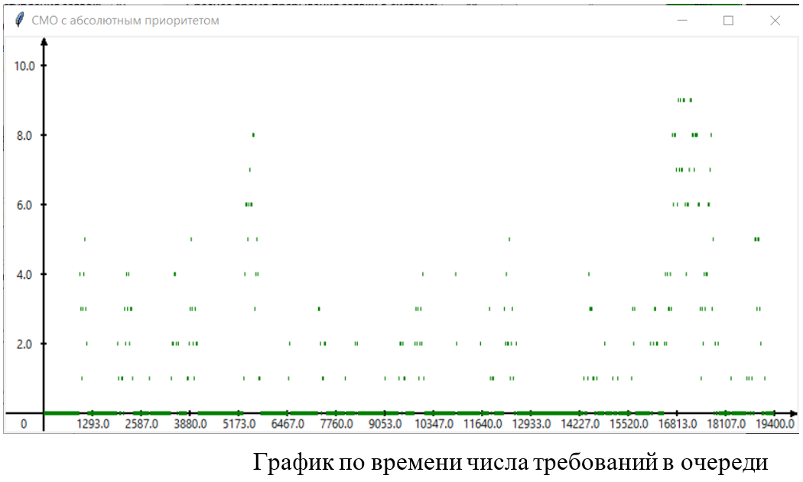
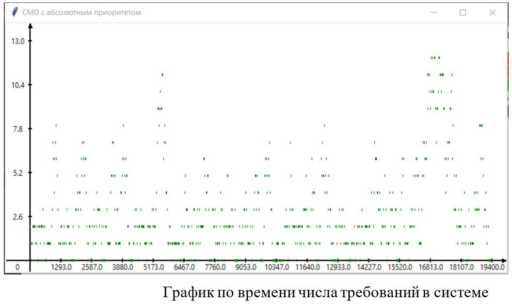
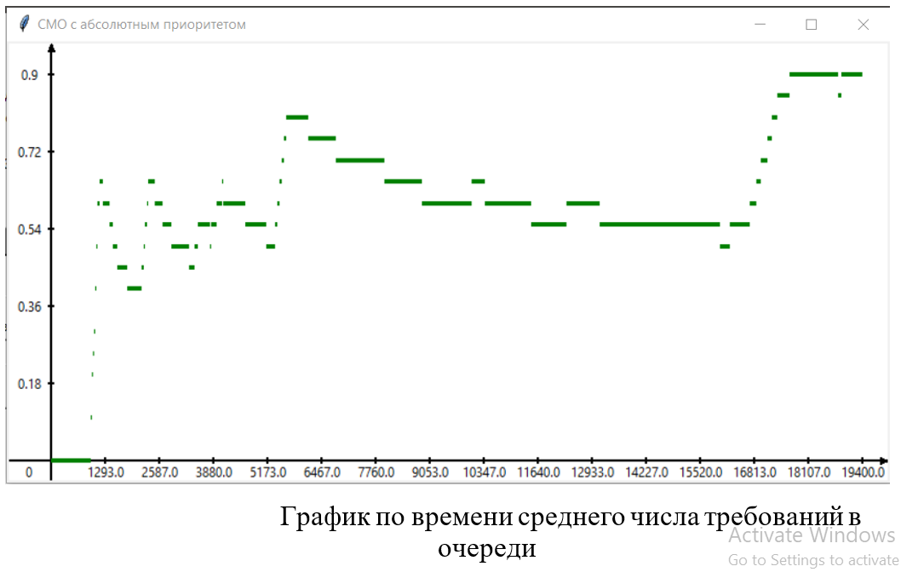
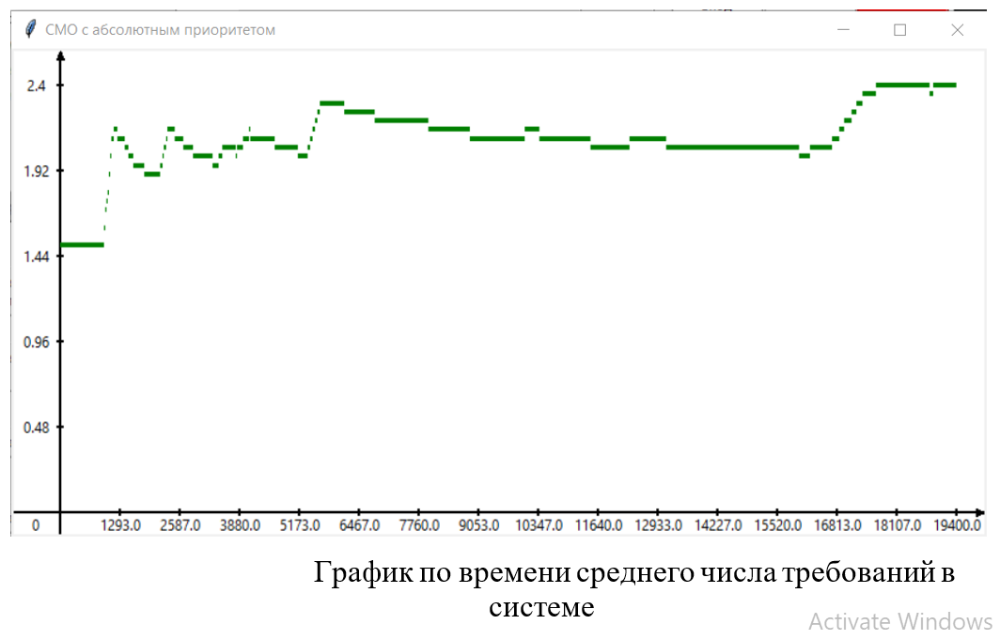
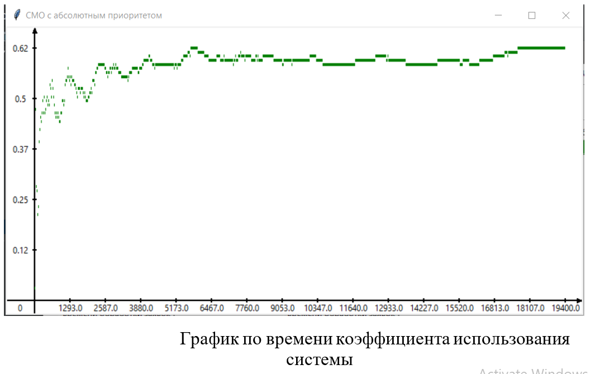